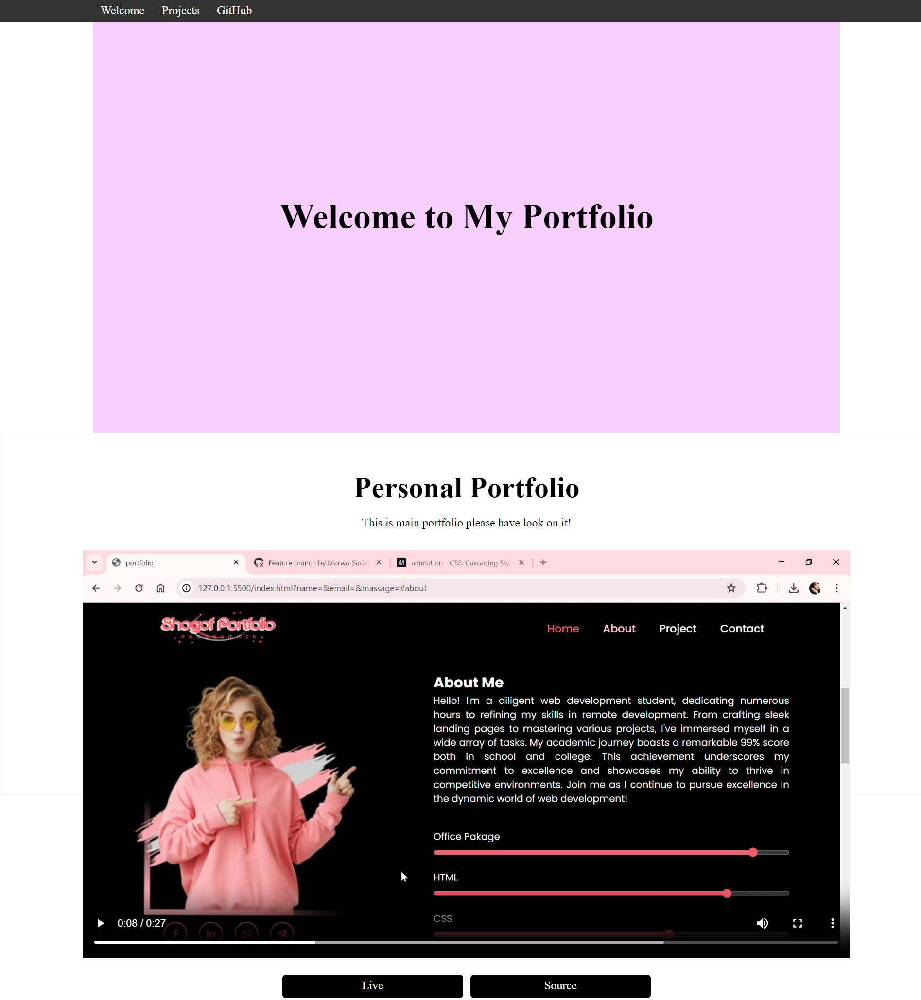

# FreeCodeCamp-Portfolio🚀

## Project Description 📝

> 🌟 Welcome to Shogofa Developer's Portfolio! 🌟

Embark on a journey through the realm of web development with me, Shogofa Developer. 🚀

As a diligent web development enthusiast, I've dedicated numerous hours to refining my skills in remote development. From crafting sleek landing pages to mastering various projects, I've immersed myself in a wide array of tasks. My portfolio showcases a range of projects, each crafted with passion and attention to detail.

Join me as I continue to pursue excellence in the dynamic world of web development! 💻✨

## Live Link

## Demo 📸



## Technologies Used 🛠️

- [HTML](https://developer.mozilla.org/en-US/docs/Web/HTML)
- [CSS](https://developer.mozilla.org/en-US/docs/Web/CSS)

## Installation 💻

To install and set up this project, simply follow these steps:

1. **Clone the repository:**
   ```bash
   git clone git@github.com:shogof/FreeCodeCamp-Portfolio.git
   ```

🎉 Once you've cloned the repository, you're all set to start exploring and using the project! If you encounter any issues or have questions, feel free to reach out for assistance. 🚀

## Usage 🎯

To use this project, follow these steps:

1. **Installation:**
   If you haven't already, follow the installation instructions mentioned in the [Installation](#installation-) section to clone the repository.

2. **Navigate to project directory:**
   ```bash
   cd FreeCodeCamp-Portfolio-page
   ```
3. **Open the HTML file:**
   Open the index.html file in your preferred web browser. You can do this by double-clicking the file or using a command-line tool like open (for macOS) or start (for Windows).

4. **Explore the documentation:**
   Once the HTML file is opened, you'll have access to the technical documentation page. Navigate through different sections using the sidebar navigation or scroll through the content to learn about various topics.

5. **Modify as needed:**
   If you'd like to customize the documentation page or add your own content, feel free to edit the HTML and CSS files in your text editor of choice.

6. **Share and contribute:**
   If you find this project helpful, consider sharing it with others. You can also contribute to the project by submitting bug reports, feature requests, or pull requests to improve it for everyone.

## Author 👩‍💻

- LinkedIn: [Shegofa Developer](www.linkedin.com/in/shegofa-developer-aa362030b)
- Email: (shogofadeveloper12@gmail.com)

## Contributing 🤝

Thank you for considering contributing to this project! Contributions from the community help improve the project for everyone.

### How to Contribute

If you'd like to contribute to this project, follow these steps:

1.  **Fork the repository:**
    Fork the repository to your own GitHub account.

2.  **Clone the repository:**
    Clone the repository to your local machine.

    ```bash
    git clone https://github.com/Shegofa/FreeCodeCamp-Portfolio.git
    ```

3.  **Create a new branch:**
    Create a new branch with a descriptive name to work on your contribution.

    ```bash
    git checkout -b feature/new-feature

    ```

4.  **Make your changes:**
    Make your changes to the project in your local environment. Ensure that your changes are in line with the project's coding conventions and style guidelines.

5.  **Commit your changes:**
    Once you've made your changes, commit them to your branch with clear and descriptive commit messages.

    ```bash
    git commit -a m 'Add new feature'

    ```

6.  **Push your changes:**
    Push your changes to your forked repository on GitHub.

    ```bash
    git push origin feature/new-feature

    ```

7.  **Submit a pull request:**
    Go to the original repository on GitHub and submit a pull request with your changes.
